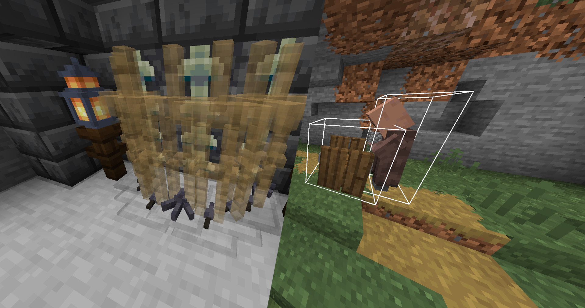

A mostly clientside Fabric mod that makes map making easier by showing you:

* mobs normally only visible in spectator
* the bounding box of interactions
* invisible itemFrames
* markers (requires server side)
* completely disable entity rendering

The mod can easily be toggled via the <kbd>N</kbd> Key

